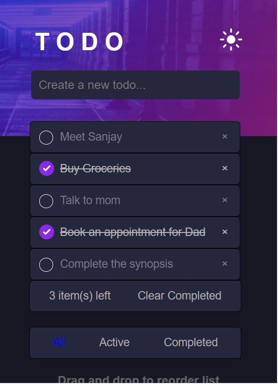

# Todo app solution

This is a solution to the [Todo app challenge on Frontend Mentor](https://www.frontendmentor.io/challenges/todo-app-Su1_KokOW). Frontend Mentor challenges help you improve your coding skills by building realistic projects. 

## Table of contents

- [Overview](#overview)
  - [The challenge](#the-challenge)
  - [Screenshot](#screenshot)
  - [Links](#links)
- [My process](#my-process)
  - [Built with](#built-with)
  - [What I learned](#what-i-learned)
  - [Useful resources](#useful-resources)
- [Author](#author)

## Overview

### The challenge

Users should be able to:

- View the optimal layout for the app depending on their device's screen size
- See hover states for all interactive elements on the page
- Add new todos to the list
- Mark todos as complete
- Delete todos from the list
- Filter by all/active/complete todos
- Clear all completed todos
- Toggle light and dark mode
- **Bonus**: Drag and drop to reorder items on the list

### Screenshot

- 
- 
- 
- 

### Links

- Live Site URL: [Todo-App](https://krishnaccbp.github.io/EY-Todo-Task/)

## My process

### Built with

- Semantic HTML5 markup
- CSS custom properties
- Flexbox
- CSS Grid
- Mobile-first workflow

### What I learned

In the below code, I have tried using the concept of events and event listeners to a much refined extent. This portion of the code belongs to the functionality of checking a Todo item.

```js
var list = document.querySelector("ul");
list.addEventListener(
  "click",
  function (ev) {
    if (ev.target.tagName === "LI") {
      ev.target.classList.toggle("checked");
      updateElementsCount();
    }
  },
  false
);
```

### Useful resources

- [W3 Schools](https://www.w3schools.com/howto/howto_js_todolist.asp) - This helped me in finding a proper blueprint for the Todo App. I really liked this pattern and will use it going forward.
- [MDN Docs](https://developer.mozilla.org/en-US/docs/Web/API/HTMLElement/dragover_event) - This is an amazing article which helped me finally understand the functionality of Drag and Drop events. I'd recommend it to anyone still learning this concept.

## Author

- Website - Krishna Sai Prashanth Biruduraju
